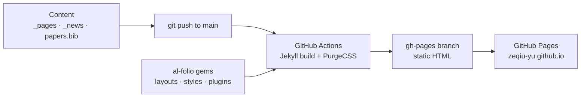

# Zeqiu (Zach) Yu · Academic Homepage

[](https://github.com/Zeqiu-Yu/Zeqiu-Yu.github.io/actions/workflows/deploy.yml)
[](LICENSE)

\[[Visit the site](https://zeqiu-yu.github.io)\] \[English | [简体中文](README_zh-CN.md)\]

_This is the source code of my academic homepage. It is built on [al-folio](https://github.com/alshedivat/al-folio) and deployed with GitHub Pages._

## Features

- A clean academic layout: a home page with bio, news, and selected publications, plus a full publications page
- Publications generated from one BibTeX file by [Jekyll Scholar](https://github.com/inukshuk/jekyll-scholar), with abstracts, DOI and arXiv buttons, and venue badges
- Light and dark mode, site search, and a mobile-friendly layout
- Automatic deployment: every push to `main` rebuilds and republishes the site

## Project Architecture

```
.
├── .github
|   └── workflows
|       └── deploy.yml             # CI: builds the site with Jekyll and publishes it to the gh-pages branch
├── _bibliography
|   └── papers.bib                 # all publications (BibTeX); selected = {true} shows a paper on the home page
├── _data
|   ├── cv.yml                     # CV data (RenderCV format); not shown on the site since the CV page was removed
|   ├── socials.yml                # email, Google Scholar, GitHub, LinkedIn
|   ├── venues.yml                 # colors of the venue badges (NeurIPS, MICCAI, SPIE, ...)
|   ├── coauthors.yml              # optional links for co-author names
|   └── ...                        # other al-folio data files (not used yet)
├── _includes
|   └── news.liquid                # local override: news dates shown as "Sep 2026"
├── _news                          # one Markdown file per news item
├── _pages
|   ├── about.md                   # home page: bio, research interests, news, selected publications
|   ├── publications.md            # publications page
|   ├── news.md                    # news archive
|   └── 404.md                     # page-not-found page
├── _sass
|   └── _themes.scss               # local override: accent color (#1c5fa8), venue badges, wider paper thumbnails
├── assets
|   ├── img                        # profile photo, favicon, and paper figures (publication_preview/)
|   ├── json                       # JSON Resume placeholder (not used)
|   └── rendercv                   # RenderCV settings, for an optional PDF version of the CV
├── bin                            # al-folio helper scripts
├── .devcontainer                  # optional VS Code dev container
├── _config.yml                    # site settings: name, URL, SEO, plugins, Jekyll Scholar
├── Gemfile, Gemfile.lock          # Ruby dependencies, including the pinned al-folio v1 gems
├── package.json, package-lock.json
├── purgecss.config.js             # removes unused CSS during the CI build
├── Dockerfile, docker-compose*.yml  # optional local preview with Docker
├── requirements.txt               # Python tools used by the al-folio scripts
├── robots.txt
├── LICENSE                        # MIT license, inherited from al-folio
├── README.md                      # this file (English)
└── README_zh-CN.md                # this file (Simplified Chinese)
```

Layouts, styles, and most features come from versioned al-folio gems (`al_folio_core`, `al_folio_cv`, and others) pinned in the `Gemfile`. This repository only holds the content, the configuration, and two small local overrides.



## Deployment

1. Push to `main`. The **Deploy site** workflow builds the site and publishes it to the `gh-pages` branch, which takes about 2–5 minutes.
2. In **Settings → Pages → Build and deployment**, set Source to **Deploy from a branch** and Branch to `gh-pages` / `(root)`. This only needs to be done once.
3. If the workflow fails with a permission error, go to **Settings → Actions → General → Workflow permissions**, select **Read and write permissions**, and re-run the workflow.

## Updating the Content

Edit a file, then commit and push to `main`. The site updates a few minutes later. Files can also be edited directly on GitHub with the pencil icon.

| To change | Edit |
| --- | --- |
| Bio and research interests | `_pages/about.md` |
| Profile photo | `assets/img/prof_pic.jpg` (replace the file) |
| News | add a Markdown file to `_news/`, following the existing ones |
| Publications | `_bibliography/papers.bib` |
| Email and profile links | `_data/socials.yml` |
| Name, site description, keywords | `_config.yml` |
| Accent color | `#1c5fa8` in `_sass/_themes.scss` (the al-folio default is `#b509ac`) |

Useful fields in `papers.bib`:

- `selected = {true}` shows the paper under "selected publications" on the home page
- `abbr = {NeurIPS}` sets the venue badge; badge colors live in `_data/venues.yml`
- `arxiv`, `pdf`, `code`, `website`, and `doi` add buttons under the paper
- `abstract` adds an "Abs" button that expands the abstract
- `preview = {xxx.png}` adds a thumbnail from `assets/img/publication_preview/`
- An asterisk after a last name marks equal contribution, for example `Yuan*, R. and Yu*, Z.`

## Local Preview

With Docker installed, run `docker compose up` and open <http://localhost:8080>. See the al-folio [installation guide](https://github.com/alshedivat/al-folio/blob/main/docs/INSTALL.md) for other options.

## License

The site code is released under the MIT License, inherited from al-folio (see [LICENSE](LICENSE)). The personal content of the site, including the text, photo, and CV, is © Zeqiu (Zach) Yu.

## Acknowledgements

This project uses source code and resources from the following projects:

- [alshedivat/al-folio](https://github.com/alshedivat/al-folio) and its plugin gems under [al-org-dev](https://github.com/al-org-dev)
- [jekyll/jekyll](https://github.com/jekyll/jekyll) and [inukshuk/jekyll-scholar](https://github.com/inukshuk/jekyll-scholar)
- [rendercv/rendercv](https://github.com/rendercv/rendercv), whose YAML format is used for the CV data
- Icons from [Font Awesome](https://fontawesome.com/) and [Academicons](https://jpswalsh.github.io/academicons/)
- The README layout follows [yaoyao-liu/minimal-light](https://github.com/yaoyao-liu/minimal-light)
