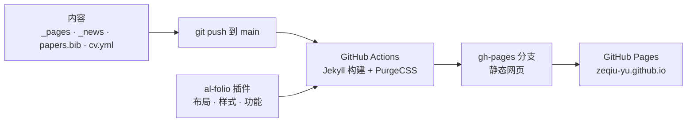

# Zeqiu (Zach) Yu · 个人学术主页

[](https://github.com/Zeqiu-Yu/Zeqiu-Yu.github.io/actions/workflows/deploy.yml)
[](LICENSE)

\[[访问主页](https://zeqiu-yu.github.io)\] \[[English](README.md) | 简体中文\]

_这是我个人学术主页的源代码，基于 [al-folio](https://github.com/alshedivat/al-folio) 搭建，通过 GitHub Pages 发布。_

## 功能

- 简洁的学术主页布局：首页有个人简介、新闻和代表性论文，另有完整的论文页和 CV 页
- 论文列表由一个 BibTeX 文件自动生成（[Jekyll Scholar](https://github.com/inukshuk/jekyll-scholar)），带摘要、DOI 和 arXiv 按钮以及会议标签
- CV 页由 YAML 文件（`_data/cv.yml`）生成
- 支持浅色和暗色模式、站内搜索，适配手机
- 自动部署：每次 push 到 `main` 都会自动重新构建并发布

## 项目结构

```
.
├── .github
|   └── workflows
|       └── deploy.yml             # 自动部署：用 Jekyll 构建网站并发布到 gh-pages 分支
├── _bibliography
|   └── papers.bib                 # 全部论文（BibTeX）；selected = {true} 的论文会显示在首页
├── _data
|   ├── cv.yml                     # CV 页的内容（RenderCV 格式）
|   ├── socials.yml                # 邮箱、Google Scholar、GitHub、LinkedIn
|   ├── venues.yml                 # 会议标签的颜色（NeurIPS、MICCAI、SPIE 等）
|   ├── coauthors.yml              # 可选：给合作者名字加链接
|   └── ...                        # al-folio 的其他数据文件（暂未使用）
├── _includes
|   └── news.liquid                # 本地覆盖：新闻日期只显示到月份，如 "Sep 2026"
├── _news                          # 每条新闻一个 Markdown 文件
├── _pages
|   ├── about.md                   # 首页：简介、研究方向、新闻、代表性论文
|   ├── publications.md            # 论文页
|   ├── cv.md                      # CV 页
|   ├── news.md                    # 新闻汇总页
|   └── 404.md                     # 404 页面
├── _sass
|   └── _themes.scss               # 本地覆盖：主题色（#1c5fa8）、会议标签样式、加宽的论文配图
├── assets
|   ├── img                        # 头像、网站图标和论文配图（publication_preview/）
|   ├── json                       # JSON Resume 占位文件（未使用）
|   └── rendercv                   # RenderCV 设置，用于生成 PDF 版 CV（可选）
├── bin                            # al-folio 的辅助脚本
├── .devcontainer                  # 可选：VS Code 开发容器配置
├── _config.yml                    # 网站设置：名字、网址、SEO、插件、Jekyll Scholar
├── Gemfile, Gemfile.lock          # Ruby 依赖，包括锁定版本的 al-folio v1 插件
├── package.json, package-lock.json
├── purgecss.config.js             # 构建时删除没用到的 CSS
├── Dockerfile, docker-compose*.yml  # 可选：用 Docker 在本地预览
├── requirements.txt               # al-folio 脚本用到的 Python 工具
├── robots.txt
├── LICENSE                        # MIT 协议，沿用自 al-folio
├── README.md                      # 说明文档（英文）
└── README_zh-CN.md                # 说明文档（简体中文）
```

页面布局、样式和大部分功能都来自 `Gemfile` 里锁定版本的 al-folio 插件（`al_folio_core`、`al_folio_cv` 等）。这个仓库只放内容、配置和两个小的本地覆盖文件。



## 部署

1. push 到 `main` 以后，**Deploy site** 会自动构建网站并发布到 `gh-pages` 分支，大约需要 2–5 分钟。
2. 打开 **Settings → Pages → Build and deployment**，Source 选 **Deploy from a branch**，Branch 选 `gh-pages` 和 `/ (root)`。这一步只需要做一次。
3. 如果构建时报权限错误，打开 **Settings → Actions → General → Workflow permissions**，选 **Read and write permissions**，然后重新运行。

## 更新内容

改完文件后 commit 并 push 到 `main`，几分钟后网站自动更新。也可以直接在 GitHub 网页上点铅笔图标编辑。

| 想改什么 | 改这个文件 |
| --- | --- |
| 简介、研究方向 | `_pages/about.md` |
| 头像 | `assets/img/prof_pic.jpg`（直接替换同名文件） |
| 新闻 | 在 `_news/` 里新建一个 Markdown 文件，照着现有文件的格式写 |
| 论文 | `_bibliography/papers.bib` |
| CV 页 | `_data/cv.yml` |
| 邮箱和各类主页链接 | `_data/socials.yml` |
| 名字、网站描述、关键词 | `_config.yml` |
| 主题色 | `_sass/_themes.scss` 里的 `#1c5fa8`（al-folio 默认是紫色 `#b509ac`） |

`papers.bib` 里常用的字段：

- `selected = {true}`：显示在首页的 selected publications 里
- `abbr = {NeurIPS}`：会议标签，颜色在 `_data/venues.yml` 里配置
- `arxiv`、`pdf`、`code`、`website`、`doi`：在论文下方加对应的按钮
- `abstract`：加一个 Abs 按钮，点开显示摘要
- `preview = {xxx.png}`：论文缩略图，图片放在 `assets/img/publication_preview/`
- 共同一作：在姓后面加星号，例如 `Yuan*, R. and Yu*, Z.`

## 本地预览

装好 Docker 后运行 `docker compose up`，然后打开 <http://localhost:8080>。其他方式见 al-folio 的[安装文档](https://github.com/alshedivat/al-folio/blob/main/docs/INSTALL.md)。

## 许可

网站代码沿用 al-folio 的 MIT 协议（见 [LICENSE](LICENSE)）。网站上的个人内容，包括文字、照片和 CV，版权归 Zeqiu (Zach) Yu 所有。

## 致谢

本项目用到了以下项目的源代码和资源：

- [alshedivat/al-folio](https://github.com/alshedivat/al-folio) 及 [al-org-dev](https://github.com/al-org-dev) 下的插件
- [jekyll/jekyll](https://github.com/jekyll/jekyll) 和 [inukshuk/jekyll-scholar](https://github.com/inukshuk/jekyll-scholar)
- [rendercv/rendercv](https://github.com/rendercv/rendercv)，CV 数据沿用它的 YAML 格式
- [Font Awesome](https://fontawesome.com/) 和 [Academicons](https://jpswalsh.github.io/academicons/) 图标
- README 的结构参考了 [yaoyao-liu/minimal-light](https://github.com/yaoyao-liu/minimal-light)
